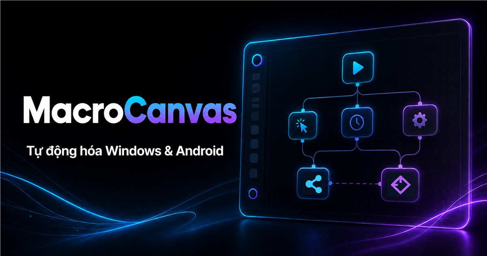
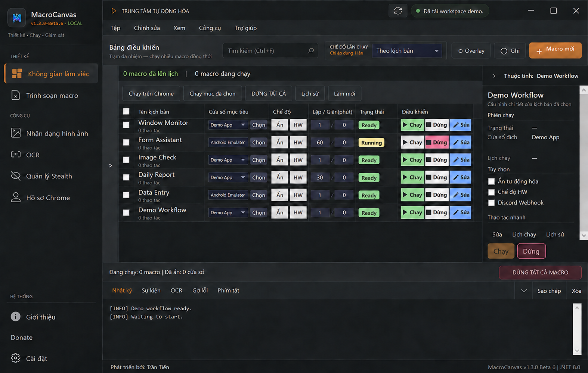

<div align="center">


# MacroCanvas

**Công cụ visual automation cho ứng dụng Windows và giả lập Android**

Tạo, chạy và giám sát workflow lặp lại mà không cần viết code.

[](https://github.com/trantien-creator/MacroCanvas/releases/tag/v1.3.0-beta.6)


[English](README.md)

**[Tải Beta 6](https://github.com/trantien-creator/MacroCanvas/releases/download/v1.3.0-beta.6/MacroCanvas-v1.3.0-beta.6-win-x64-Setup.exe)** · **[Nhận key miễn phí](https://cyber-bike-56a.notion.site/MacroCanvas-License-20-Thi-t-B-30-Ng-y-3d6cdffabe278141a343ea8872c11687)** · **[Xem demo](#demo)**

[Website](https://macrocanvas.pages.dev/) · [Tất cả bản phát hành](https://github.com/trantien-creator/MacroCanvas/releases)

</div>

> [!WARNING]
> Beta 6 chưa được ký số. Windows SmartScreen có thể hiện cảnh báo. Chỉ tải từ repository chính thức này và đối chiếu SHA256 trước khi chạy bộ cài.

> [!NOTE]
> MacroCanvas là tên mới của SmartMacroAI. Beta 6 tự động chuyển settings, scripts, templates và trạng thái license; thư mục dữ liệu cũ vẫn được giữ làm nguồn khôi phục.

## MacroCanvas dùng để làm gì?

MacroCanvas là công cụ visual automation trên desktop dành cho ứng dụng Windows và giả lập Android.
Ứng dụng kết hợp trình soạn workflow, công cụ ghi thao tác, nhận diện ảnh, OCR, điều kiện, vòng lặp, lịch chạy và chẩn đoán trong một giao diện.
Mục tiêu là giúp người dùng tạo, kiểm tra và duy trì các tác vụ lặp lại thuận tiện hơn.

## Lợi ích chính

- Tạo workflow trực quan với các bước tuần tự và nhánh lồng nhau.
- Tự động hóa ứng dụng Windows qua HWND, input và chế độ driver tùy chọn.
- Điều khiển giả lập Android qua ADB mà không chiếm con trỏ Windows.
- Ghi và chỉnh sửa Click, Drag, Key, Text, Wait, Scroll và Screenshot.
- Phản ứng theo trạng thái giao diện bằng nhận diện ảnh và OCR.
- Sử dụng biến, dữ liệu CSV, workflow con, điều kiện và vòng lặp.
- Theo dõi bằng log, trạng thái bước, breakpoint, Pause và Resume.
- Dùng tọa độ phần trăm cho workflow cần thích ứng với kích thước mục tiêu.

## Demo

<p align="center">
  
</p>

<p align="center">
  
</p>
Screenshot sử dụng dữ liệu demo trung tính, không chứa tên workflow cá nhân, cửa sổ đích, đường dẫn local, key hoặc log riêng tư.

## Trình soạn workflow trực quan

- Chuyển đổi giữa danh sách tuần tự và sơ đồ.
- Thêm, đổi tên, bật, tắt, nhân bản, sao chép, dán và sắp xếp bước.
- Biểu diễn Repeat, Try/Catch, If Variable, If Image và If Text lồng nhau.
- Theo dõi bước hiện tại, thời gian, đường dẫn thực thi và trace gần nhất.
- Khóa thao tác chỉnh sửa khi workflow đang chạy.

## Tự động hóa Windows và giả lập Android

| Mục tiêu | Công dụng | Lưu ý |
|---|---|---|
| Windows/HWND | Workflow cho ứng dụng desktop | Khả năng chạy nền phụ thuộc ứng dụng đích và input mode. |
| Raw hoặc hardware input | Ứng dụng không nhận window message | Có thể cần foreground và ảnh hưởng chuột hoặc bàn phím vật lý. |
| Driver tùy chọn | Tương thích input cấp thấp | Cần quyền Administrator, cài driver và khởi động lại. |
| Giả lập Android qua ADB | Tap, swipe, key, text và capture | Thiết bị ADB được chọn phải ở trạng thái `device`. |

## Tải Beta 6

| Gói | Kích thước | Tải xuống |
|---|---:|---|
| Bộ cài Windows x64 | 237 MiB | [Setup EXE](https://github.com/trantien-creator/MacroCanvas/releases/download/v1.3.0-beta.6/MacroCanvas-v1.3.0-beta.6-win-x64-Setup.exe) |
| Bản portable Windows x64 | 354 MiB | [ZIP](https://github.com/trantien-creator/MacroCanvas/releases/download/v1.3.0-beta.6/MacroCanvas-v1.3.0-beta.6-win-x64.zip) |
| Checksum | — | [SHA256SUMS.txt](https://github.com/trantien-creator/MacroCanvas/releases/download/v1.3.0-beta.6/SHA256SUMS.txt) |


## Kiểm tra file tải xuống

```powershell
Get-FileHash .\MacroCanvas-v1.3.0-beta.6-win-x64-Setup.exe -Algorithm SHA256
Get-Content .\SHA256SUMS.txt
```

So sánh kết quả với `SHA256SUMS.txt`.
Không chạy file nếu hai giá trị không khớp.

## Bắt đầu nhanh

1. Tải bộ cài Beta 6 hoặc bản ZIP portable.
2. Kiểm tra SHA256 của file.
3. Cài hoặc giải nén MacroCanvas rồi kích hoạt bằng beta key hợp lệ.
4. Tạo workflow hoặc mở script đã lưu.
5. Chọn ứng dụng Windows hoặc giả lập ADB khả dụng.
6. Thêm hoặc ghi thao tác, lưu workflow, chạy thử và kiểm tra log.

## Quyền truy cập Beta miễn phí

Key Community dùng thử được cung cấp tại [trang nhận beta key](https://cyber-bike-56a.notion.site/MacroCanvas-License-20-Thi-t-B-30-Ng-y-3d6cdffabe278141a343ea8872c11687).
Giới hạn thiết bị và thời hạn hiện tại được hiển thị trên trang đó.
Quyền truy cập Beta có thể thay đổi hoặc kết thúc khi sản phẩm chuyển sang thương mại.

## Hoạt động của tọa độ

Click và Drag dùng tọa độ phần trăm sẽ được tính lại theo client area Windows hoặc kích thước màn hình Android hiện tại.
Tọa độ pixel, vùng tìm ảnh và vùng OCR vẫn có thể cần điều chỉnh khi resolution, aspect ratio, orientation hoặc DPI thay đổi.
Luôn chạy thử workflow sau khi chuyển sang môi trường khác.

## Tài liệu kỹ thuật

- [Local HTTP API](docs/HTTP-API.md)
- [Discord Webhook](docs/DISCORD-WEBHOOK.md)
- [OCR](docs/OCR.md)
- [ADB và giả lập Android](docs/ADB.md)

## Yêu cầu hệ thống

- Windows 10 build 19041 trở lên.
- Windows 64-bit cho gói phát hành hiện tại.
- Đủ dung lượng; cần kết nối ADB khi tự động hóa giả lập Android.
- Chỉ cần quyền Administrator khi cài driver tùy chọn.

## Giới hạn của bản Beta

- Bộ cài chưa có chữ ký số.
- Mức tương thích thay đổi theo ứng dụng đích và input mode.
- Cổng ADB và khả năng capture khác nhau giữa các giả lập.
- Nhận diện ảnh phụ thuộc UI mục tiêu, scaling và chất lượng template.

## Quyền riêng tư, điều khoản và giấy phép

- [Chính sách quyền riêng tư](PRIVACY.md)
- [Điều khoản sử dụng và EULA](TERMS.md)
- [Giấy phép proprietary](LICENSE)
- [Lịch sử phát hành](CHANGELOG.md)

MacroCanvas là phần mềm proprietary do **Trần Tiến** phát triển.
Copyright © 2026. All rights reserved.

## Hỗ trợ

- [Tạo issue](https://github.com/trantien-creator/MacroCanvas/issues)
- Email: `hotrantentien98@gmail.com`
- Website: [macrocanvas.pages.dev](https://macrocanvas.pages.dev/)

Repository public này chứa tài liệu sản phẩm và file phát hành chính thức.
Repository không chứa source code riêng tư, credential, license secret hoặc dữ liệu người dùng.
